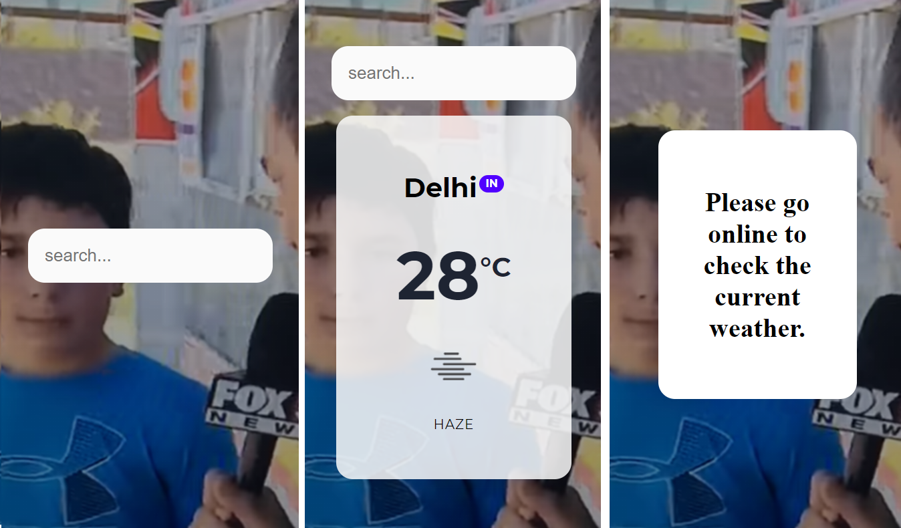
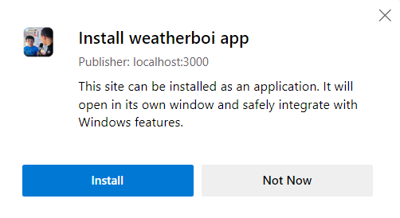
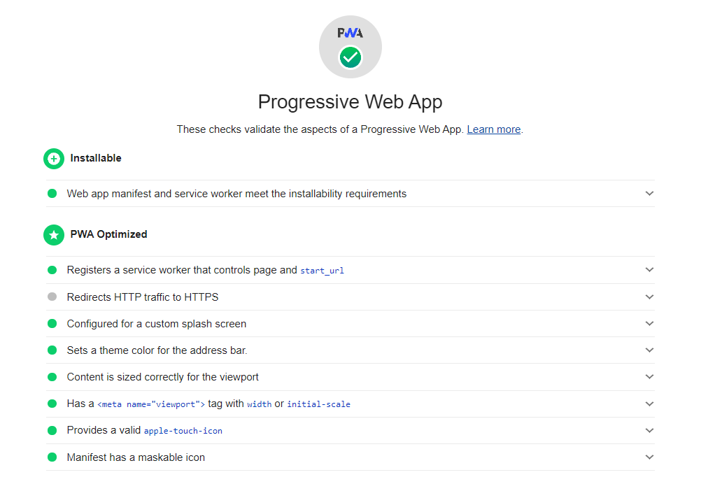

# weatherboi


<p align="center">
    
    <br>
 </p>
<p align="center">
he tells the weather.
</p>


weatherboi is a [Progressive Web App][pwa] (PWA) using ReactJS and [JavaScript Service Worker API][swjs]

# Tech Stack 📚

<p align="center">


</p>

# Screenshots




Desktop installable



# Progressive Web App



# Setup

- change ```.env.example``` file to ```.env``` and enter the Openweathermap.org URL and API Key
- run ```npm i && npm start``` for both client and server side to start the app

[swjs]: //developer.mozilla.org/en-US/docs/Web/API/Service_Worker_API
[pwa]: //web.dev/progressive-web-apps/
